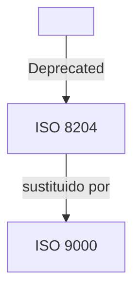
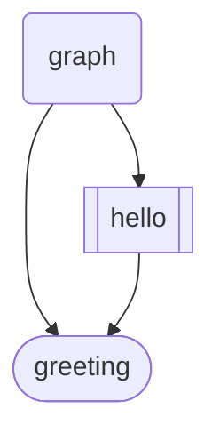
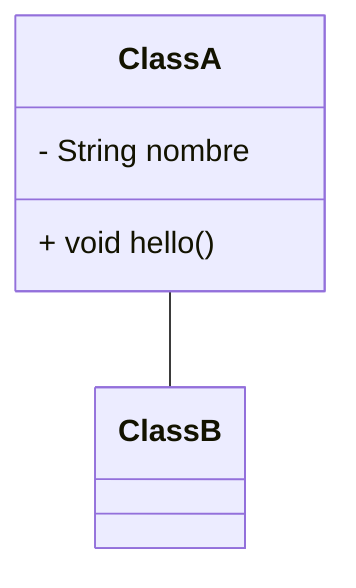

# Calidad

---

- **Tester**: Busca lo que se le pidió, no importa como lo hiciste. Son reglas explicitas. Es reemplazable (expendable).

- **QA**: Busca errores y defectos para que no se propaguen. Comparte desarrollador y QA la responsabilidad de los fallos. Va mas allá que el ==**tester**==. Es mas imprescindible. Evita/reduce el riesgo, reduce el *re-trabajo*
	- Testea codigo y proceso.
	- Datos, independencia, etc...
	- Analisis de impacto.
	- Integracion del sistema y su consistencia.
  Su herramienta principal es el testCase
	
---

==Esfuerzo:== Gente, recursos...

==Peer review:== Estandares, calidad, documentacion ...

==Issue tracker:== Trello, Jira...

==Wireframe:== Representacion visual del requisito -> Mockups

---

